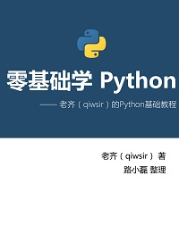
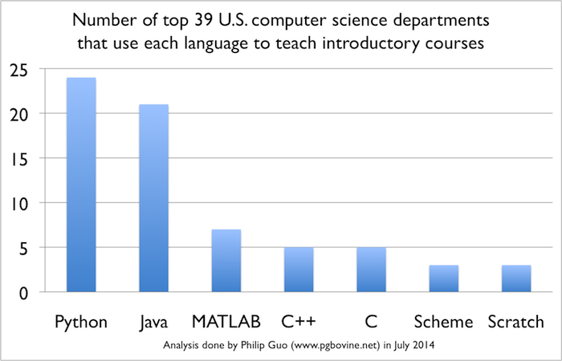

## 声明

这个“零基础学Python”并不是我写的，原内容来自于[这里](https://github.com/qiwsir/ITArticles/blob/master/BasicPython/index.md)，我只是将其Github的MarkDown内容整理成了Gitbook格式方便阅读。

我已经联系作者qiwsir，同意我整理，欢迎大家多多支持原作者。

原作者：老齐（qiwsir），Github：[https://github.com/qiwsir](https://github.com/qiwsir)

## GitHub托管

https://github.com/JackChan1999/learn-python-from-zero

## GitBook在线阅读

在线阅读，PDF、ePub、Mobi电子书下载

https://www.gitbook.com/book/alleniverson/learn-python-from-zero/details

## StarterLearningPython

https://www.gitbook.com/book/alleniverson/starterlearningpython/details

## Python 基础入门教程

https://www.gitbook.com/book/alleniverson/python2-course/details

## 为什么要开设此栏目

这个栏目的名称叫做“零基础学Python”。

现在网上已经有不少学习python的课程，其中也不乏精品。按理说，不缺少我这个基础类型的课程了。但是，我注意到一个问题，不管是课程还是出版的书，大多数是面向已经有一定编程经验的人写的或者讲的，也就是对这些朋友来讲，python已经不是他们的第一门高级编程语言。据我所知，目前国内很多大学都是将Ｃ之类的做为学生的第一门语言。

然而，在我看来，python是非常适合做为学习高级语言编程的第一门语言的。有一本书，名字叫《与孩子一起学编程》，这本书的定位，是将python定位为学习者学习的第一门高级编程语言。然而，由于读者对象是孩子，很多“成年人”不屑一顾，当然，里面的讲法与“实战”有点距离，导致以“找工作”、“工作需要”为目标的学习者，认为这本书跟自己要学的方向相差甚远。

为了弥补那本书的缺憾，我在这里推出面向成年人——大学生、或者其他想学习程序但是没有任何编程基础的朋友——学习第一门编程高级语言的教程。将Python做为学习高级语言编程的第一门语言，其优势在于：

- 入门容易，避免了其它语言的繁琐。
- 更接近我们的自然语言和平常的思维方法。
- 学习完这门语言之后，能够直接“实战”——用在工作上。
- 学习完这门语言之后，能够顺利理解并学习其它语言。
- python本身功能强大，一门语言也可以打天下，省却了以后的学习成本。

下面的图示统计显示：Python现在成为美国名校中最流行的编程入门语言。

综上，我有了这样一个冲动，做一个栏目，面对零基础要学习Python的朋友，面对将python做为第一门高级语言的朋友。这就是开始本栏目的初衷。

## 目录

* [第零部分 独上高楼，望尽天涯路](https://alleniverson.gitbooks.io/learn-python-from-zero/content/)
   * [唠叨一些关于python的事情](https://alleniverson.gitbooks.io/learn-python-from-zero/content/001.html)
   * [Python现在成为美国名校中最流行的编程入门语言](https://alleniverson.gitbooks.io/learn-python-from-zero/content/reading/Python现在成为美国名校中最流行的编程入门语言.html)
* [第一部分 积小流，至江海](https://alleniverson.gitbooks.io/learn-python-from-zero/content/100/README.html)
   * [Python环境安装](https://alleniverson.gitbooks.io/learn-python-from-zero/content/100/101.html)
   * [集成开发环境（IDE）](https://alleniverson.gitbooks.io/learn-python-from-zero/content/100/102.html)
   * [数的类型和四则运算](https://alleniverson.gitbooks.io/learn-python-from-zero/content/100/103.html)
   * [啰嗦的除法](https://alleniverson.gitbooks.io/learn-python-from-zero/content/100/104.html)
   * [开始真正编程](https://alleniverson.gitbooks.io/learn-python-from-zero/content/100/105.html)
   * [初识永远强大的函数](https://alleniverson.gitbooks.io/learn-python-from-zero/content/100/106.html)
   * [玩转字符串(1)：基本概念、字符转义、字符串连接、变量与字符串关系](https://alleniverson.gitbooks.io/learn-python-from-zero/content/100/107.html)
   * [玩转字符串(2)](https://alleniverson.gitbooks.io/learn-python-from-zero/content/100/108.html)
   * [玩转字符串(3)](https://alleniverson.gitbooks.io/learn-python-from-zero/content/100/109.html)
   * [眼花缭乱的运算符](https://alleniverson.gitbooks.io/learn-python-from-zero/content/100/110.html)
   * [从if开始语句的征程](https://alleniverson.gitbooks.io/learn-python-from-zero/content/100/111.html)
   * [一个免费的实验室](https://alleniverson.gitbooks.io/learn-python-from-zero/content/100/112.html)
   * [有容乃大的list(1)](https://alleniverson.gitbooks.io/learn-python-from-zero/content/100/113.html)
   * [有容乃大的list(2)](https://alleniverson.gitbooks.io/learn-python-from-zero/content/100/114.html)
   * [有容乃大的list(3)](https://alleniverson.gitbooks.io/learn-python-from-zero/content/100/115.html)
   * [有容乃大的list(4)](https://alleniverson.gitbooks.io/learn-python-from-zero/content/100/116.html)
   * [list和str比较](https://alleniverson.gitbooks.io/learn-python-from-zero/content/100/117.html)
   * [画圈还不简单吗](https://alleniverson.gitbooks.io/learn-python-from-zero/content/100/118.html)
   * [再深点，更懂list](https://alleniverson.gitbooks.io/learn-python-from-zero/content/100/119.html)
   * [字典，你还记得吗？](https://alleniverson.gitbooks.io/learn-python-from-zero/content/100/120.html)
   * [字典的操作方法](https://alleniverson.gitbooks.io/learn-python-from-zero/content/100/121.html)
   * [有点简约的元组](https://alleniverson.gitbooks.io/learn-python-from-zero/content/100/122.html)
   * [一二三,集合了](https://alleniverson.gitbooks.io/learn-python-from-zero/content/100/123.html)
   * [集合的关系](https://alleniverson.gitbooks.io/learn-python-from-zero/content/100/124.html)
   * [Python数据类型总结](https://alleniverson.gitbooks.io/learn-python-from-zero/content/100/125.html)
   * [深入变量和引用对象](https://alleniverson.gitbooks.io/learn-python-from-zero/content/100/126.html)
   * [赋值，简单也不简单](https://alleniverson.gitbooks.io/learn-python-from-zero/content/100/127.html)
   * [坑爹的字符编码](https://alleniverson.gitbooks.io/learn-python-from-zero/content/100/128.html)
   * [做一个小游戏](https://alleniverson.gitbooks.io/learn-python-from-zero/content/100/129.html)
   * [不要红头文件(1): open, write, close](https://alleniverson.gitbooks.io/learn-python-from-zero/content/100/130.html)
   * [不要红头文件(2): os.stat, closed, mode, read, readlines, readline](https://alleniverson.gitbooks.io/learn-python-from-zero/content/100/131.html)
* [第二部分 穷千里目，上一层楼](https://alleniverson.gitbooks.io/learn-python-from-zero/content/200/README.html)
   * [正规地说一句话](https://alleniverson.gitbooks.io/learn-python-from-zero/content/200/201.html)
   * [print能干的事情](https://alleniverson.gitbooks.io/learn-python-from-zero/content/200/202.html)
   * [从格式化表达式到方法](https://alleniverson.gitbooks.io/learn-python-from-zero/content/200/203.html)
   * [复习if语句](https://alleniverson.gitbooks.io/learn-python-from-zero/content/200/204.html)
   * [用while来循环](https://alleniverson.gitbooks.io/learn-python-from-zero/content/200/205.html)
   * [难以想象的for](https://alleniverson.gitbooks.io/learn-python-from-zero/content/200/206.html)
   * [关于循环的小伎俩](https://alleniverson.gitbooks.io/learn-python-from-zero/content/200/207.html)
   * [让人欢喜让人忧的迭代](https://alleniverson.gitbooks.io/learn-python-from-zero/content/200/208.html)
   * [大话题小函数(1)](https://alleniverson.gitbooks.io/learn-python-from-zero/content/200/209.html)
   * [大话题小函数(2)](https://alleniverson.gitbooks.io/learn-python-from-zero/content/200/210.html)
   * [python文档](https://alleniverson.gitbooks.io/learn-python-from-zero/content/200/211.html)
   * [重回函数](https://alleniverson.gitbooks.io/learn-python-from-zero/content/200/212.html)
   * [变量和参数](https://alleniverson.gitbooks.io/learn-python-from-zero/content/200/213.html)
   * [总结参数的传递](https://alleniverson.gitbooks.io/learn-python-from-zero/content/200/214.html)
   * [传说中的函数条规](https://alleniverson.gitbooks.io/learn-python-from-zero/content/200/215.html)
   * [关于类的基本认识](https://alleniverson.gitbooks.io/learn-python-from-zero/content/200/216.html)
   * [编写类之一创建实例](https://alleniverson.gitbooks.io/learn-python-from-zero/content/200/217.html)
   * [编写类之二方法](https://alleniverson.gitbooks.io/learn-python-from-zero/content/200/218.html)
   * [编写类之三子类](https://alleniverson.gitbooks.io/learn-python-from-zero/content/200/219.html)
   * [编写类之四再论继承](https://alleniverson.gitbooks.io/learn-python-from-zero/content/200/220.html)
   * [命名空间](https://alleniverson.gitbooks.io/learn-python-from-zero/content/200/221.html)
   * [类的细节](https://alleniverson.gitbooks.io/learn-python-from-zero/content/200/222.html)
   * [Import 模块](https://alleniverson.gitbooks.io/learn-python-from-zero/content/200/223.html)
   * [模块的加载](https://alleniverson.gitbooks.io/learn-python-from-zero/content/200/224.html)
   * [私有和专有](https://alleniverson.gitbooks.io/learn-python-from-zero/content/200/225.html)
   * [折腾一下目录: os.path.&lt;attribute>](https://alleniverson.gitbooks.io/learn-python-from-zero/content/200/226.html)
* [第三部分 昨夜西风，亭台谁登](https://alleniverson.gitbooks.io/learn-python-from-zero/content/300/README.html)
   * [网站的结构：网站组成、MySQL数据库的安装和配置、MySQL的运行](https://alleniverson.gitbooks.io/learn-python-from-zero/content/300/301.html)
   * [通过Python连接数据库：安装python-MySQLdb，连接MySQL](https://alleniverson.gitbooks.io/learn-python-from-zero/content/300/302.html)
   * [用Pyton操作数据库(1)：建立连接和游标，并insert and commit](https://alleniverson.gitbooks.io/learn-python-from-zero/content/300/303.html)
   * [用Python操作数据库（2）](https://alleniverson.gitbooks.io/learn-python-from-zero/content/300/304.html)
   * [用Python操作数据库（3）](https://alleniverson.gitbooks.io/learn-python-from-zero/content/300/305.html)
   * [python开发框架：框架介绍、Tornado安装](https://alleniverson.gitbooks.io/learn-python-from-zero/content/300/306.html)
   * [第一个网页分析：tornado网站的基本结构剖析](https://alleniverson.gitbooks.io/learn-python-from-zero/content/300/307.html)
   * [实例分析get和post](https://alleniverson.gitbooks.io/learn-python-from-zero/content/300/308.html)
   * [问候世界：利用GAE建立tornado框架网站](https://alleniverson.gitbooks.io/learn-python-from-zero/content/300/309.html)
   * [使用表单和模板:tornado模板self.render和模板变量传递](https://alleniverson.gitbooks.io/learn-python-from-zero/content/300/311.html)
   * [模板中的语法：tornado模板中的for,if,set等语法](https://alleniverson.gitbooks.io/learn-python-from-zero/content/300/312.html)
   * [静态文件以及一个项目框架](https://alleniverson.gitbooks.io/learn-python-from-zero/content/300/313.html)
   * [模板转义](https://alleniverson.gitbooks.io/learn-python-from-zero/content/300/314.html)
* [第四部分 暮然回首，灯火阑珊处](https://alleniverson.gitbooks.io/learn-python-from-zero/content/400/README.html)
   * [requests库](https://alleniverson.gitbooks.io/learn-python-from-zero/content/400/401.html)
   * [比较json/dictionary的库](https://alleniverson.gitbooks.io/learn-python-from-zero/content/400/402.html)
   * [defaultdict 模块和 namedtuple 模块](https://alleniverson.gitbooks.io/learn-python-from-zero/content/400/403.html)
* [第五部分 Python备忘录](https://alleniverson.gitbooks.io/learn-python-from-zero/content/500/README.html)
   * [基本的（字面量）值](https://alleniverson.gitbooks.io/learn-python-from-zero/content/500/501.html)
   * [运算符](https://alleniverson.gitbooks.io/learn-python-from-zero/content/500/502.html)
   * [常用的内建函数](https://alleniverson.gitbooks.io/learn-python-from-zero/content/500/503.html)
* [扩展阅读(来自网络文章)](https://alleniverson.gitbooks.io/learn-python-from-zero/content/reading/README.html)
   * [人生苦短，我用Python](https://alleniverson.gitbooks.io/learn-python-from-zero/content/reading/01.html)

## 关注我

- Email：<619888095@qq.com>
- CSDN博客：[Allen Iverson](http://blog.csdn.net/axi295309066)
- 新浪微博：[AndroidDeveloper](http://weibo.com/u/1848214604?topnav=1&wvr=6&topsug=1&is_all=1)
- GitHub：[JackChan1999](https://github.com/JackChan1999)
- GitBook：[alleniverson](https://www.gitbook.com/@alleniverson)
- 个人博客：[JackChan](https://jackchan1999.github.io/)